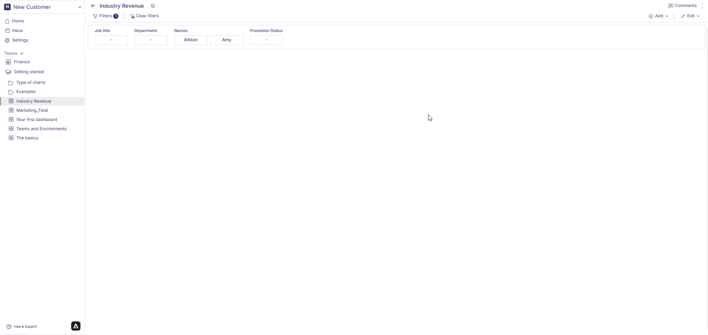

Headline statistics are used to display key metrics or "headlines" of data in a easily understandable format. These charts often highlight the most important information at a glance. For instance, they might include summary statistics, key performance indicators (KPIs), or other critical data points.

In a business context, headline charts could be used on dashboards or executive summaries to provide quick insights into overall performance or trends without overwhelming the viewer with too much detail.

## How to create a Headline Statistics

### 1. Configure your Workbook
1. Open your dashboard, switch to **Edit mode**, then click **Add container**.  
2. Select **Data visualization** and click **Create** to open the chart builder.  
3. Choose a dataset from the catalog panel and double-click the column names you want to use.  
   The selected columns will appear in the **Workbook**, where you can prepare the data used for your headline metrics.

---

### 2. Apply Aggregation
Headline Statistics requires at least one aggregated value.  
Use **Aggregation** in Workbook to generate the main metric and comparison metric.

#### Aggregate your data
1. Click the **⋮** button on the numeric column you want to summarize.  
2. Choose one of the supported aggregation methods: Count, Sum, Average, Minimum, Maximum
3. The aggregated result will appear immediately in the Workbook.

#### (Optional) Apply filters
1. Click the column header.  
2. Select **Filter on this column**, choose a value or condition, and click **Apply**.  
3. The Workbook will update to display only the filtered aggregated results.

Your headline chart will use these aggregated (and optionally filtered) values.

### 3. Configure your chart
1. Open your dashboard, switch to **Edit mode**, and add a new visualization container.  
2. Select **Data visualization** and click **Create** to open the chart builder.  
3. Choose a dataset from the catalog and verify that Workbook aggregations and filters have been applied correctly.  
4. In the **General** section, set the chart title and description, then select **Headline** as the chart type.  
5. In the **Data** section, choose the datasheet, then select the **Data field** (main value) and **Reference field** (comparison value).  
   At least one aggregated value is required for the chart to be displayed.  
6. In **Display options**, configure the appearance of your headline:
   - Enter the **Title** and **Subtitle**.  
   - Adjust **font sizes** using the dropdown selectors.  
   - Add a **Prefix** or **Suffix** (e.g., $, %, units).  
   - Enable **Show percentage** to display the comparison as a percentage.  
   All configuration changes are reflected instantly in the chart preview.

### 4. Save the chart
Once all configurations are complete:  
1. Review the chart preview to ensure it displays the correct aggregated and reference values.  
2. Click **Create visualization** in the top-right corner.  
3. The headline chart will be saved and added to your dashboard, where you can resize or reposition it as needed.

## How to edit a headline statistics?

Hover over a headline statistics container from the dashboard. Three dots will appear on the top right hand corner of the chart container. Click on the three dots and an option menu will appear. Click on 'edit' from the option menu. After making the chages to the chart, click on change table from the top right corner of the page. Your chart changes is saved and chart is displayed on the dashboard. 

### How to delete a headline statistics?

Hover over a healine statistics container from the dashboard. Three dots will appear on the top right hand corner of the chart container. Click on the three dots and an option menu will appear. Click on 'delete' from the option menu. Click on delete to confirm your choice. Your chart is permanently deleted. 

In next page we are going to walk you through how you can create a [pie and donut chart](piechart) in the Anlytic platform. 